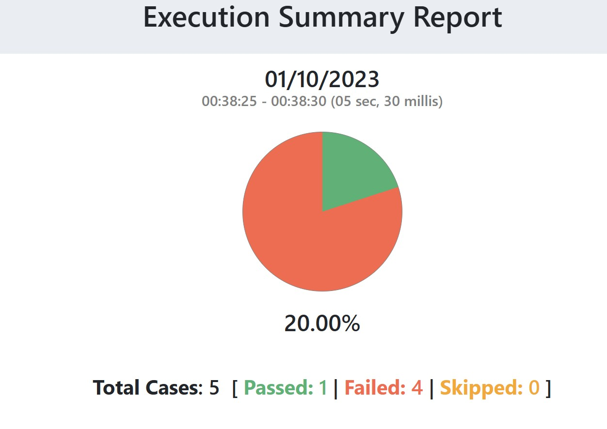
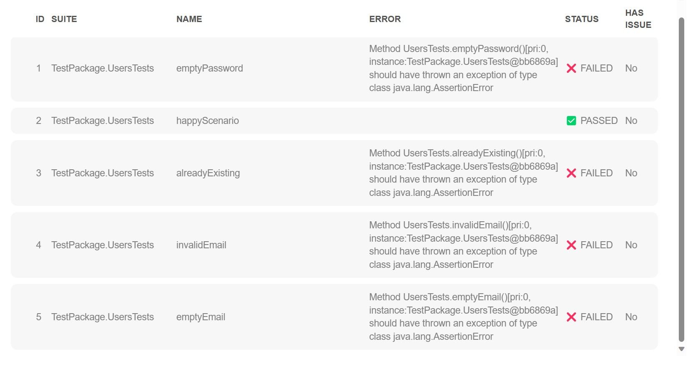

# API

## How do I run it?
To execute this project follow these simple steps:
- From your right-hand maven menu, run ```Lifecycle > clean```
- Then run ```Lifecycle > test```
  (This will ensure that this test module is built and executed successfully without any errors.)
- The execution report will launch in your default browser once test execution is complete.

## How do I explore it?
After checking out this project to your IDE, you should find this basic folder structure:
- ```pom.xml``` <br/>This is the main project object model file which houses the SHAFT_Engine version and some basic project configuration.
- ```src > main > resources``` <br/>Here you will find your SHAFT_Engine ```*.properties``` files to manage all your settings.
- ```src > test > java``` <br/>Here you will find your ```TestPackage.UserTests``` where you will be able to observe how a fluent designed test method looks like, how to use some of the recommended annotations/parameters for allure and testng, practice test isolation, and just play around with the engine in a more well-structured project.

## Testing Checklist
1. create new user - valid data (Happy Scenario)
2. create new user - invalid data - already existing
3. create new user - invalid data - invalid email
4. create new user - invalid data - empty email
5. create new user - invalid data - empty password

## Sample Execution report:



### NOTE: Only the happy scenario passed :(