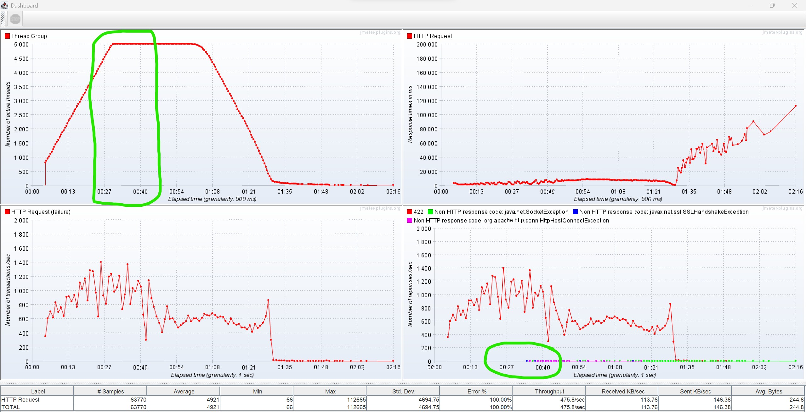

# API_Performance

## Initial Performance Benchmarking:
Initial performance analysis of the target url shows Excellent Best Practices and Accessibility, Good SEO optimization, mediocre Performance via desktop, and poor performance via mobile.
You can access the full analysis report via this URL: [PageSpeed](https://pagespeed.web.dev/analysis/https-oyn-adminportal-qc-demo-salmonsky-1edff179-westeurope-azurecontainerapps-io-identity-login/1062qy26rm?form_factor=desktop)

## In order to reach the maximum number of concurrent users that the site can handle, we will use Jmeter-DSL:

Data-Analysis shows that the website starts failing to respond after around 5000 parallel requests, held for 2-3 seconds.

